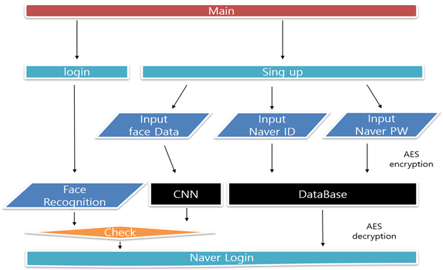
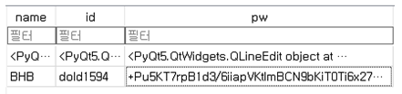
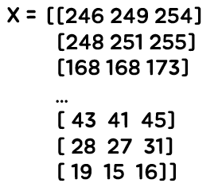
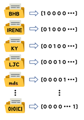
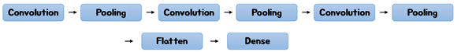
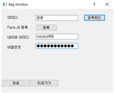
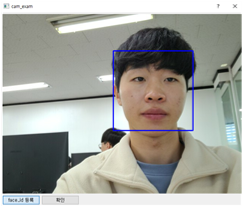
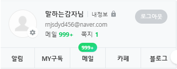

# face-recognition

<h1 style="color:#3f3f">작품 목표</h1>

웹캠을 통해 연결된 실시간 영상 속 사람의 얼굴을 인식하고, 미리 학습된 CNN 모델을 통하여 사용자 등록이 된 얼굴들과 특징을 비교하여 일치 여부를 판단하고 일치한다면 사용자 확인이 된 것으로 판단하고 웹사이트 접근을 허락해 주는 서비스를 제공하는 것이 목표이다.

<h1 style="color:#3f3f">구현 환경</h1>

- 파이썬의 장점 중 하나인 라이브러리가 많다는 점을 이용하여 머신러닝 기능 구현부터 디비 연결, GUI제작, 얼굴인식까지 기능 구현을 목적으로 사용하였다.

- 실시간 컴퓨터 비전을 목적으로 한 프로그래밍 라이브러리로 OpenCV를 이용하여 캠을 사용해 영상을 출력하며 영상을 이용하여 여러 장의 이미지를 저장하였다.

- tensorflow : 사진들을 비교하는 작업을 진행 하며, 얼굴 이미지를 1차원 벡터로 정보를 압축하여 유사도 검사를 하였다. 
- Keras : 이미지를 다양한 각도로 증가시키고, 증가시킨 여러 장의 사진을 학습시켜 인식률을 높여 더 정확한 결과를 도출할 수 있게 하였다.

<h1 style="color:#3f3f">기능</h1>

>회원가입(등록)
>>-사용자의 정보를 입력받고 얼굴 데이터를 수집한다. 입력받은 사용자의 정보 중 패스워드는 AES 알고리즘을 이용하여 암호화를 진행한다.

>얼굴 인식
>>얼굴을 인식하기 위해서 회원가입 시 수집한 얼굴 데이터를 부풀린 후 라벨링 작업을 통하여 전처리 과정을 거친다. 그 후 CNN 모델을 이용하여 학습을 진행한 후 학습한 데이터를 이용하여 얼굴을 인식한다.

>로그인
>>접근제어를 위해 사용자의 생체정보 중 하나인 얼굴을 저장 후 기존에 학습시킨 얼굴 데이터와 비교 후 인가된 사용자임을 확인시킨 후 데이터베이스에 저장되어있는 사용자의 정보를 바탕으로 접근 사용하여 서비스를 제공받는다.

<h1 style="color:#3f3f">상세 구성도</h1>

1. 얼굴 데이터 및 사용자 정보 수집
 - CNN 알고리즘에 적용할 학습 데이터를 준비하여야 한다. 사용자의 데이터는 시스템 사용자의 얼굴 이미지가 필요하기 때문에 회원가입을 통하여 사용자의 정보 중 웹사이트 패스워드는 AES 256Bit 암호화를 거쳐 DB(데이터베이스)에 등록하고 얼굴 데이터도 등록 받는다. 등록한 사용자 정보는 아래 그림과 같이 저장이 된다. 
  

 - 얼굴 데이터는 OpenCV와 사람의 얼굴 데이터가 학습된 haarcascade_frontalface_default.xml 모델을 이용하여 실시간 웹캠 속에서 배경부분을 제외하고 사용자의 얼굴 부분만 자른 얼굴 데이터를 30장 수집한다.

2. 데이터 부풀리기
 - 시스템 사용자의 얼굴 데이터를 수집했다면 CNN 알고리즘의 정확도를 높이기 위해서는 더 많은 데이터가 필요하다. 데이터를 늘리기 위해서 수집한 사용자의 데이터를 Keras의 ImageDataGenerator를 이용하여 좌우 반전, 각도 조절, 확대하여 사용자의 얼굴 데이터 한 개에 21장씩 추가 생성하여 총 659장으로 얼굴 데이터를 부풀린다.

3. 라벨링 작업
 - CNN 알고리즘은 Input으로 Label이 붙은 이미지 파일을 주고 수많은 이미지를 학습시키고 다음에 새로운 이미지가 입력되었을 때 정확히 Label을 붙이는 것을 목적으로 하기 때문에 라벨링 작업을 정확히 해주어야 한다. 라벨링 작업은 수집된 시스템 사용자의 데이터를 RGB 형태로 변환한 뒤 64 * 64 로 resize를 해준다. 그리고 그 값을 numpy 배열로 바꾼 뒤 X에 저장한다.[그림 1]은 Numpy값 중 한 개를 표시한 값이다. 그리고 category값은 Y값으로 저장한다. [그림 2]는 Y값을 이미지화 것이다. 이 값은 increase_image_data.npy 파일로 저장한다.
  
   
 　　　　　　　　<a style="color:gold">그림 1</a>　　　　　　　　　　　　　　<a style="color:gold">그림 2</a>

4. CNN
 - 라벨링 작업이 끝난 increase_image_data.npy 파일을 불러와 load 해준다. 그 후 [그림 10]과 같이 CNN 알고리즘을 구축해야 한다. 먼저 Convolution layer와 Max Pooling를 이용하여 데이터의 특징을 추출하여야 한다. 3 x 3 필터를 가진 Convolution layer를 총 3번 각각 32개, 64개, 128개의 필터를 사용하였으며 Convolution layer의 단계마다 Max Pooling 단계를 추가하여 Convolution layer의 출력 데이터를 입력으로 받아서 출력 데이터(Activation Map)의 크기를 2 X 2 사이즈로 줄이는 용도로 사용하였다. Convolution layer와 Max Pooling 단계가 끝나면 특징 추출 단계가 끝이 나고 이미지 분류 단계에 들어가야 한다. Flatten layer를 이용하여 2차원 데이터를 1차원 데이터로 바꿔주었고 Dense layer를 이용하여 이미지의 특징을 추출하고 분류하였다. 그 후 CNN 학습 결과를 CNN.model로 저장한다.
 

5. 모델 테스트
 - 학습된 CNN 모델을 통하여 얼굴 예측 테스트를 진행하였다. 얼굴 예측 테스트는 이전에 사용하지 않은 데이터로 구성하였으며 OpenCV와 haarcascade_frontalface_default.xml 모델을 이용하여 배경을 제외한 얼굴 부분만 자른 얼굴 데이터로 만들어 예측을 진행한다.

6. 실시간 얼굴 검출 후 얼굴 인식
 - OpenCV와 haarcascade_frontalface_default.xml 모델을 이용하여 실시간 웹캠 속에서 배경 부분을 제외하고 사용자의 얼굴 부분만 자른 얼굴 데이터를 10장 저장한다. 저장한 얼굴 데이터를 Numpy 값으로 저장한 후 기존에 학습시킨 CNN 모델을 통해 예측을 수행한다. 1장의 사진으로는 사용자를 잘못 인식할 수 있으므로 10장의 사진을 이용하여 예측을 수행한다. 10장의 사진 중 8장 이상 나온 사용자로 예측하며 8장 이하라면 예측을 실패한다.

7. 사용자 인증 완료
 - 예측한 사용자와 로그인 할 때 입력한 아이디와 같다면 성공적으로 사용자 인증이 완료된다. CNN 모델을 이용하여 얼굴 예측과 사용자 인증이 성공적으로 이루어져 시스템에 로그인이 되었다면 DB(데이터 베이스)에 저장된 웹 사이트 아이디와 AES 256Bit로 암호화된 비밀번호를 복호화하여 가져온 뒤 웹 사이트를 로그인 해준다. 

  
<h1 style="color:#3f3f">결과</h1>

### 메인 화면

### 얼굴 인식

### 인증 완료